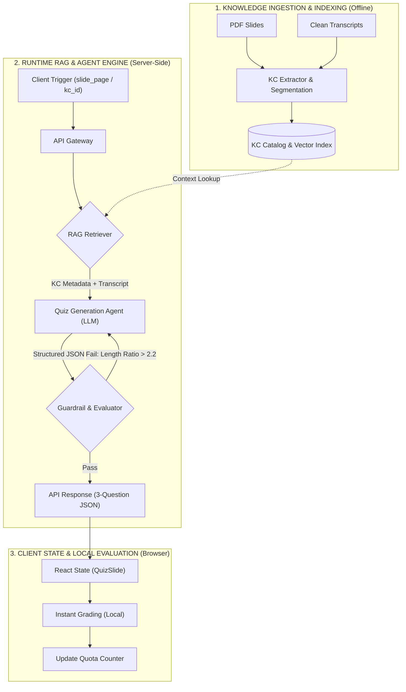
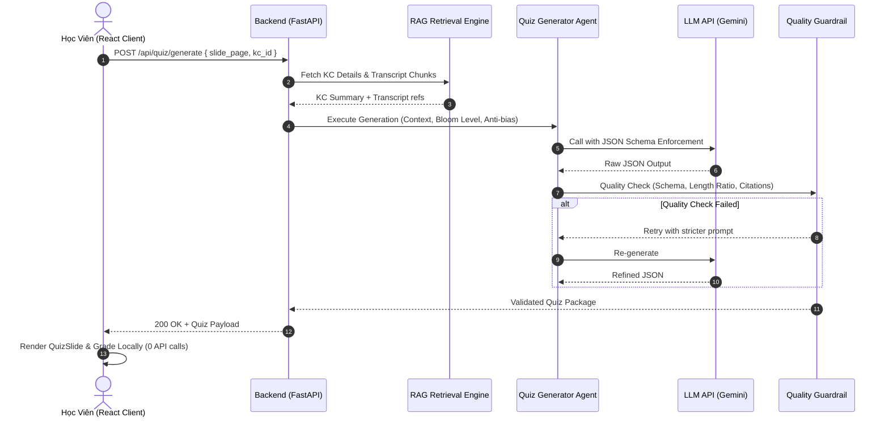

# 📓 K3-parknotech Dev Diary: VLearn Tutor & RAG Agent Tech Spec

Tài liệu này ghi chép lại quá trình phát triển, các quyết định kiến trúc và hướng dẫn kỹ thuật cho dự án **VLearn Tutor** (Tính năng Micro-quiz) trong khuôn khổ AI Thực Chiến Hackathon.

---

## 1. Bối Cảnh Bài Toán & Khảo Sát Thực Tế (Context)

### Bằng Chứng Khảo Sát Thực Tế Học Viên Trong Lớp (Survey Responses - N = 20)

**A. Hành vi kiểm chứng mức độ hiểu bài (Verification Behavior)**
- **40,0%** (8/20): Cảm thấy hiểu nhưng không có cách kiểm chứng cụ thể.
- **25,0%** (5/20): Phải tự đặt câu hỏi và tự trả lời.
- **25,0%** (5/20): Phải làm lại bài tập được giao.

**B. Khó khăn lớn nhất khi ôn tập**
- **65,0%** (13/20) chỉ dành ≤ 15 phút hoặc không ôn tập gì sau buổi học.
- *"Slide quá dài và nhiều thông tin, không biết nên học thế nào."*
- *"Tài liệu dài lan man, hay đọc thừa… tốn rất nhiều thời gian để nhớ bài học."*

**C. Mức độ sẵn sàng trải nghiệm Beta:** **95,0%** (19/20 học viên).

---

## 2. Định Hướng Kiến Trúc Lõi

### Bottom-Up Architectural Decision
- **Loại bỏ Top-Down:** Không bắt AI đọc toàn bộ PDF. Rủi ro: lan man, bẫy "đáp án dài nhất", tốn quota.
- **Áp dụng Bottom-Up:** Phân rã thành Knowledge Component (KC) nguyên tử → sinh 3 câu cho đúng 1 KC.

### One-Sentence Architectural Slice
> "Học viên bấm 'Kiểm tra nhanh' → AI Agent gọi RAG lấy Transcript [Txx-NNN] → sinh 3 câu Micro-Quiz (Bloom Level + Cân bằng độ dài) → JSON về Client chấm điểm Local."

---

## 3. Kiến Trúc Hệ Thống (System Architecture)

### Data Flow



### Sequence Diagram



---

## 4. Knowledge Component Catalog (`kc_index.json`)

```json
[
  {
    "kc_id": "KC_FEW_SHOT_01",
    "kc_title": "Few-shot Prompting",
    "slide_pages": [14, 15],
    "transcript_refs": ["T04-025", "T04-026", "T04-027"],
    "concept_summary": "Phương pháp cung cấp ví dụ mẫu (input-output demonstrations) trong prompt để định hướng mô hình.",
    "learning_objective": "Phân biệt Few-shot với Zero-shot và giải thích khi nào cần dùng ví dụ mẫu.",
    "bloom_level": "Comprehension/Application",
    "common_misconceptions": [
      "Nhầm lẫn Few-shot là fine-tuning",
      "Nghĩ rằng Few-shot luôn yêu cầu mô hình lớn hơn Zero-shot"
    ]
  }
]
```

### Retrieval Strategy
- **Primary:** Metadata Lookup theo `slide_pages` → O(1).
- **Fallback:** Dense Vector Search (BGE-M3 / BGE-Small) → Top-2 KC tương đồng Cosine cao nhất.

---

## 5. AI Agent & Anti-Bias Engineering

### Structured Output Schema

```json
{
  "kc_id": "string",
  "kc_title": "string",
  "questions": [
    {
      "id": "integer",
      "prompt": "string",
      "options": ["string x4"],
      "correct_index": "0-3",
      "explanation": "string",
      "citation": "[Txx-NNN]"
    }
  ]
}
```

### System Prompt Rules
1. **SINGLE-KC FOCUS:** Chỉ hỏi trong phạm vi KC được cung cấp.
2. **OPTION LENGTH BALANCE:** 4 lựa chọn phải có độ dài tương đương (variance ≤ 20%).
3. **MISCONCEPTION DISTRACTORS:** Đáp án sai lấy từ `common_misconceptions`.
4. **CITATION REQUIREMENT:** Mọi giải thích phải trích dẫn `[Txx-NNN]`.

---

## 6. Guardrails & Risk Taxonomy

**Option Length Ratio Metric:**
> Length Ratio = max(len) / min(len) ≤ 2.2. Nếu vượt → Retry 1 lần.

| Lớp Rủi Ro | Nguy Cơ | Cơ Chế Kiểm Soát |
| :--- | :--- | :--- |
| ① Nguồn sự thật | AI sáng tác ngoài slide | RAG bám sát 100% `[Txx-NNN]` + citation bắt buộc |
| ② Mơ hồ | Slide quá ngắn | Dùng Transcript giảng viên làm Ground Truth |
| ③ Ngoài scope | User đòi đề thi chính thức | Chỉ trả Micro-quiz diagnostic |
| ④ Domain bias | Bẫy "câu dài nhất đúng" | Option Length Ratio ≤ 2.2 |

---

## 7. Client Architecture & Quota Optimization

- **1 batch = 1 API Call** → sinh 3 câu hỏi.
- **Chấm điểm Local:** React `useState`, 0ms latency, 0 API calls khi grading.
- **Quota Budget:** Tối đa 15 lượt/ngày.

---

## 8. Cấu Trúc Backend (Modular Design)

```text
codebase/backend/
├── app/
│   ├── api/chat.py             # Endpoint API
│   ├── agent/
│   │   ├── tools.py            # Wrap Qdrant search thành Tool
│   │   └── workflow.py         # Tool -> Context -> LLM
│   ├── ingestion/
│   │   ├── loaders.py          # PyMuPDF đọc file
│   │   ├── splitters.py        # RecursiveTextSplitter
│   │   └── pipeline.py         # Ingestion Pipeline
│   ├── services/
│   │   ├── embedding.py        # FastEmbed (dev) / FlagEmbedding BGE-M3 (prod)
│   │   ├── llm.py              # Gemini API
│   │   └── vector_store.py     # Qdrant (Hybrid Dense + Sparse)
│   ├── core/config.py          # Environment Settings
│   └── main.py                 # FastAPI App
├── .env / .env.example
└── run_ingest.py               # CLI script nạp dữ liệu
```

---

## 9. Dev Setup (Chạy Local)

```bash
# 1. Khởi động Qdrant
docker compose up -d qdrant

# 2. Backend
cd codebase/backend
uv venv --python 3.11 && source .venv/bin/activate
uv pip install -r requirements.txt
python -m uvicorn app.main:app --reload

# 3. Ingest dữ liệu
python run_ingest.py

# 4. Frontend
cd codebase && npm install && npm run dev
```

---

## 10. Frontend Gap Analysis & Completion Plan (2026-07-30)

### Các thiếu hụt kỹ thuật đã phát hiện
- Frontend prototype cũ gom hầu hết logic trong `codebase/src/App.jsx`, khó kiểm soát state khi mở rộng flow quiz.
- Trigger tạo quiz còn hardcode slide 14 và không bám trạng thái bài học/KC đang chọn.
- URL backend hardcode `http://localhost:8000`, chưa hỗ trợ cấu hình qua `VITE_API_BASE_URL`.
- Quota hiển thị `14/15` là mock, chưa có bộ đếm local theo ngày và chưa disable khi hết quota.
- Quiz loading/error dùng trạng thái mơ hồ `questions.length === 0`, chưa phân biệt loading, lỗi HTTP, response rỗng.
- Chưa hiển thị đầy đủ `kc_id`, `kc_title`, citation và `guardrail_warnings` từ backend.
- Chat trigger dựa vào chuỗi phản hồi chứa chữ `quiz`, chưa liên kết với KC/slide hiện hành.
- Chưa có test frontend cho API contract, quota local và chấm điểm local.
- CSS thiếu responsive cho màn hình tablet/mobile và option quiz dùng clickable `div` thay vì control có keyboard support.

### Plan build hoàn thiện frontend
- Tách module thuần: `api.js`, `quota.js`, `quizUtils.js`, `courseContent.js`.
- Refactor UI để sidebar chọn lesson/KC, document viewer render slide hiện hành, quiz generate gửi `{ slide_page, kc_id, user_prompt? }`.
- Chấm điểm local bằng React state, không gọi API sau khi quiz đã load.
- Ghi quota browser-local trong `localStorage` theo ngày với limit mặc định 15 lượt.
- Hiển thị loading/error/retry rõ ràng, citation từng câu và warning guardrail ở quiz panel.
- Thêm `npm run test` dùng `node --test` cho các module không phụ thuộc browser.
- Sau mỗi turn build code, append log ngắn vào mục Build Turn Log.

### Build Turn Log

| Turn | Date/Time | Scope | Files changed | Commands run | Result | Next |
|---|---|---|---|---|---|---|
| 10 | 2026-07-31 10:30 +07:00 | Pull remote main and merge popup-toolbar/RAG changes safely | `codebase/backend/app/agent/workflow.py`, `codebase/backend/app/services/kc_catalog.py`, plus restored local source changes from Turn 9 and prior fixes | `git log --oneline --decorate HEAD..origin/main`; `git diff --name-status HEAD..origin/main`; `git stash push -u -m pre-remote-merge-selection-scope`; `git stash push -m pre-remote-merge-pycache`; `git pull --no-rebase origin main`; `git checkout 'stash@{1}' -- ...`; `npm.cmd run test`; `npm.cmd run build`; `docker compose exec -T backend python -m unittest tests.test_api_selection_scope tests.test_selection_scope_workflow tests.test_quiz_workflow_fallback`; `docker compose exec -T backend python -m compileall app tests`; `git diff --check` | Pulled remote commit `3ed67e1` and merged source on top; kept local explicit `selected_text` contract, local slide/transcript fallback, and immediate popup Ask AI chat flow; incorporated remote improvements for file-aware KC lookup and query-first RAG retrieval to reduce history pollution; tests/build pass | Stashes `pre-remote-merge-selection-scope` and `pre-remote-merge-pycache` remain as backups until cleanup is approved |
| 9 | 2026-07-31 10:11 +07:00 | Wire highlighted-text popup toolbar actions to selection-scoped quiz and AI chat | `codebase/src/App.jsx`, `codebase/src/api.js`, `codebase/src/selectionToolbar.js`, `codebase/src/api.test.js`, `codebase/src/selectionToolbar.test.js`, `codebase/backend/app/models/schemas.py`, `codebase/backend/app/api/chat.py`, `codebase/backend/app/api/quiz.py`, `codebase/backend/app/agent/workflow.py`, `codebase/backend/tests/test_selection_scope_workflow.py`, `codebase/backend/tests/test_api_selection_scope.py` | `npm.cmd run test`; `npm.cmd run build`; `docker compose exec -T backend python -m unittest tests.test_selection_scope_workflow tests.test_quiz_workflow_fallback`; `docker compose exec -T backend python -m unittest tests.test_api_selection_scope tests.test_selection_scope_workflow tests.test_quiz_workflow_fallback`; `docker compose exec -T backend python -m compileall app tests`; `docker compose logs --tail=80 backend`; `docker compose logs --tail=80 frontend` | Popup `Tạo quiz` now uses the same quiz flow as the topbar while sending `selected_text` as a hard scope for RAG/prompting; popup `Hỏi AI` now sends an immediate chat message with a prepared explanation prompt and selected text context; backend schema/endpoints/workflow pass selected text into retrieval and prompt construction without the old out-of-scope reject guard for trusted selection text; tests/build pass | Optional browser smoke test can validate text-selection UX end to end after refreshing the Vite tab |
| 8 | 2026-07-31 09:45 +07:00 | Fix quiz rejection on unmapped slides and missing Qdrant collection | `codebase/src/App.jsx`, `codebase/backend/app/agent/tools.py`, `codebase/backend/app/agent/workflow.py`, `codebase/backend/app/services/local_content.py`, `codebase/backend/app/services/vector_store.py`, `codebase/backend/tests/test_quiz_workflow_fallback.py` | `docker compose logs --tail 200 backend`; Chrome tab inspection via connector; `docker compose exec -T backend python -c ...`; `docker compose exec -T backend python -m unittest tests.test_quiz_workflow_fallback`; `npm.cmd run test`; `Invoke-RestMethod POST /api/quiz/generate`; Chrome click `Tạo quiz` | Root cause: current Day 01 slide had no KC and Qdrant collection was absent, while frontend sent a synthetic `user_prompt`; backend treated it as a conversational topic and model returned the out-of-scope JSON. Frontend no longer sends synthetic user_prompt for default quiz clicks; backend builds a dynamic KC from local slide PDF text and falls back to local transcripts when Qdrant is empty; direct API and Chrome UI quiz generation now return 200 | If Qdrant ingestion is required for full semantic RAG quality, run/review `run_ingest.py`; old chat error remains in localStorage history until cleared |
| 7 | 2026-07-31 09:20 +07:00 | Fix frontend container dependency drift, react-pdf import error, PDF fetch runtime error, and backend startup side effects | `docker-compose.yml`, `codebase/src/dockerCompose.test.js`, `codebase/src/backendStartup.test.js`, `codebase/backend/app/services/embedding.py`, `codebase/backend/app/services/vector_store.py`, `codebase/backend/app/services/llm.py` | `npm.cmd test -- src/dockerCompose.test.js`; `docker compose config`; `docker compose up -d --build frontend`; `docker compose exec -T frontend npm ls react-pdf pdfjs-dist react-markdown remark-gfm`; `docker compose exec -T frontend npm run build`; `node check_errors.cjs`; `npm.cmd test -- src/backendStartup.test.js`; `docker compose restart backend`; `docker compose exec -T backend python -m compileall app`; `Invoke-WebRequest /docs`; `Invoke-WebRequest /slides/d1-slide-hackathon.pdf` | Frontend container now runs `npm ci` before Vite so the anonymous `/app/node_modules` volume cannot stay stale after dependency changes or rewrite `package-lock.json`; `react-pdf` resolves in Docker; backend no longer loads embedding models or provider clients during app import; `/docs` and `/slides` return 200; browser runtime check has no import/PDF fetch errors | A full backend image rebuild is still recommended before handoff because the current running container had `openai` installed interactively after the old image missed it |
| 6 | 2026-07-31 02:40 +07:00 | Add UI-only selection toolbar for highlighted PDF text | `codebase/src/App.jsx`, `codebase/src/styles.css`, `codebase/src/selectionToolbar.js`, `codebase/src/selectionToolbar.test.js` | `npm.cmd run test`; `npm.cmd run build` | Highlighting PDF text now shows a compact toolbar with `Hỏi AI` and `Tạo quiz`; toolbar actions are intentionally UI-only and do not call chat/quiz logic yet; tests pass 21/21 and build passes | Wire toolbar actions to real ask-AI and quiz flows when product behavior is confirmed |
| 5 | 2026-07-31 02:26 +07:00 | Fix full-PDF slide viewer, zoom controls, slide asset serving, and file-scoped quiz KC detection | `codebase/src/App.jsx`, `codebase/src/api.js`, `codebase/src/api.test.js`, `codebase/src/courseContent.js`, `codebase/src/courseContent.test.js`, `codebase/src/styles.css`, `codebase/backend/app/main.py`, `codebase/backend/app/models/schemas.py`, `codebase/backend/app/api/quiz.py`, `codebase/backend/app/services/kc_catalog.py`, `codebase/backend/app/agent/workflow.py`, `codebase/backend/app/core/config.py`, `codebase/backend/.env.example`, `docker-compose.yml` | `npm.cmd run test`; `npm.cmd run build`; `docker compose config`; `git diff --check`; `python --version` | Frontend now keeps sidebar at file level, renders every PDF page, adds working zoom in/out/reset toolbar, sends `file_id` + current `kc_id` in quiz generation, and serves slide PDFs via backend `/slides`; tests pass 18/18 and build passes; compose config is valid with only obsolete `version` warning; Python is not available locally for backend compile check | Review UI with backend running and real slide PDFs; rebuild/restart Docker services because compose/backend env/static mount changed |
| 4 | 2026-07-31 02:09 +07:00 | Pull remote `main` and merge with local LLM/frontend fixes | `codebase/src/App.jsx`, `codebase/src/quizUtils.test.js`, `codebase/src/styles.css`, plus previously staged LLM/frontend files | `git stash push`; `git pull --no-rebase origin main`; `git stash pop`; `npm.cmd install`; `npm.cmd run test`; `npm.cmd run build`; `git diff --check` | Pulled remote commit `ab6d6fa`; resolved conflicts by keeping remote PDF/chat flow and local structured LLM error UX, retry prompt, citation note, and per-question retry; frontend tests pass 14/14 and build passes | Review staged local changes; stash backup `stash@{0}` remains until user decides to drop |
| 3 | 2026-07-31 01:32 +07:00 | Fix quiz generation error visibility and complete missing frontend UX paths | `codebase/src/App.jsx`, `codebase/src/api.js`, `codebase/src/quizUtils.js`, `codebase/src/styles.css`, `codebase/src/api.test.js`, `codebase/src/quizUtils.test.js`, `codebase/backend/app/agent/workflow.py`, `codebase/backend/app/api/quiz.py` | `npm.cmd run test`; `npm.cmd run build`; `docker compose exec -T backend python -c ...`; `Invoke-RestMethod POST /api/quiz/generate`; Chrome reproduced original failure | Root cause identified as invalid Gemini API key (`API_KEY_INVALID`); backend now returns structured LLM diagnostics; frontend preserves chat prompt, validates quiz contract, shows provider/context error guidance, shows citation note, and supports retry per question without API call | Replace invalid Gemini key or switch `DEFAULT_LLM_MODEL` to OpenAI with valid key, then rebuild/restart backend before final demo |
| 2 | 2026-07-31 00:56 +07:00 | Add configurable LLM default model and provider routing for Gemini/OpenAI | `codebase/backend/app/core/config.py`, `codebase/backend/app/services/llm.py`, `codebase/backend/.env.example`, `codebase/backend/.env`, `codebase/backend/requirements.txt` | `python -c ...` timed out; `py -3 -B ...` reported no installed Python; `git status -sb` | Default model set to `gemini-2.5-flash-lite`; OpenAI config added with `gpt-4o-mini`; provider inferred from `DEFAULT_LLM_MODEL` | Review quiz generation with real API key, rebuild backend image if running Docker |
| 1 | 2026-07-30 | Hoàn thiện frontend micro-quiz working prototype, quota local, API helper, tests, responsive CSS | `codebase/src/App.jsx`, `codebase/src/styles.css`, `codebase/src/api.js`, `codebase/src/quota.js`, `codebase/src/quizUtils.js`, `codebase/src/courseContent.js`, `codebase/src/*.test.js`, `codebase/package.json` | `node --test src\\*.test.js` RED rồi GREEN; `npm.cmd install`; `npm.cmd run test`; `npm.cmd run build` | Test pass 7/7; Vite build pass; frontend đã bỏ hardcode slide/quota/backend URL default và dùng selected KC | Review UI thực tế với backend đang chạy, kiểm tra Docker rebuild nếu deploy qua compose/image |
