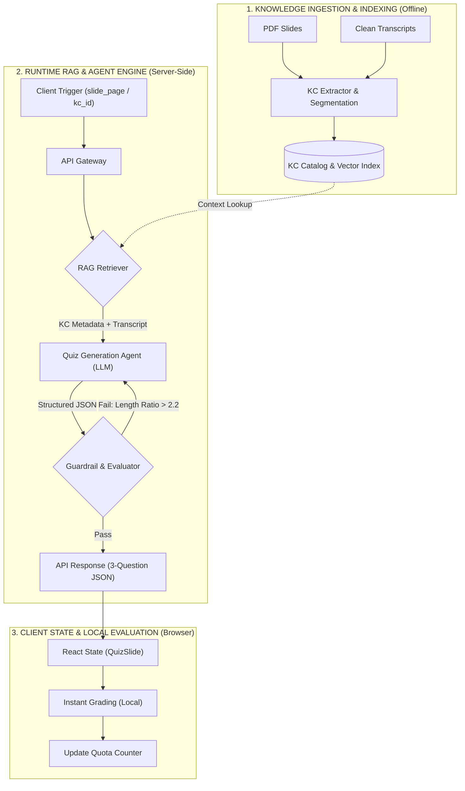
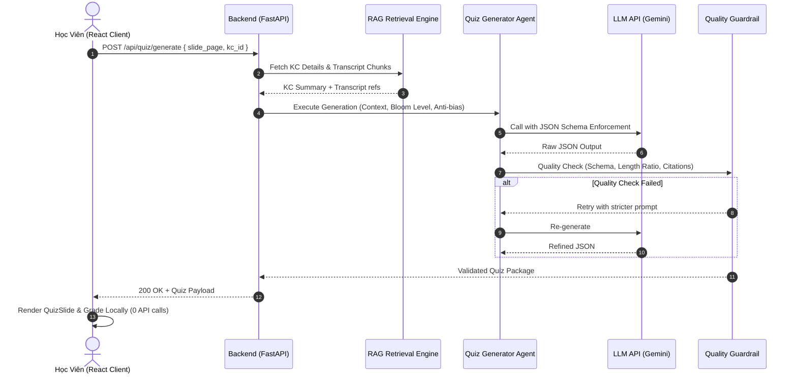

# 📓 K3-parknotech Dev Diary: VLearn Tutor & RAG Agent Tech Spec

Tài liệu này ghi chép lại quá trình phát triển, các quyết định kiến trúc và hướng dẫn kỹ thuật cho dự án **VLearn Tutor** (Tính năng Micro-quiz) trong khuôn khổ AI Thực Chiến Hackathon.

---

## 1. Bối Cảnh Bài Toán & Khảo Sát Thực Tế (Context)

### Bằng Chứng Khảo Sát Thực Tế Học Viên Trong Lớp (Survey Responses - N = 20)

**A. Hành vi kiểm chứng mức độ hiểu bài (Verification Behavior)**
- **40,0%** (8/20): Cảm thấy hiểu nhưng không có cách kiểm chứng cụ thể.
- **25,0%** (5/20): Phải tự đặt câu hỏi và tự trả lời.
- **25,0%** (5/20): Phải làm lại bài tập được giao.

**B. Khó khăn lớn nhất khi ôn tập**
- **65,0%** (13/20) chỉ dành ≤ 15 phút hoặc không ôn tập gì sau buổi học.
- *"Slide quá dài và nhiều thông tin, không biết nên học thế nào."*
- *"Tài liệu dài lan man, hay đọc thừa… tốn rất nhiều thời gian để nhớ bài học."*

**C. Mức độ sẵn sàng trải nghiệm Beta:** **95,0%** (19/20 học viên).

---

## 2. Định Hướng Kiến Trúc Lõi

### Bottom-Up Architectural Decision
- **Loại bỏ Top-Down:** Không bắt AI đọc toàn bộ PDF. Rủi ro: lan man, bẫy "đáp án dài nhất", tốn quota.
- **Áp dụng Bottom-Up:** Phân rã thành Knowledge Component (KC) nguyên tử → sinh 3 câu cho đúng 1 KC.

### One-Sentence Architectural Slice
> "Học viên bấm 'Kiểm tra nhanh' → AI Agent gọi RAG lấy Transcript [Txx-NNN] → sinh 3 câu Micro-Quiz (Bloom Level + Cân bằng độ dài) → JSON về Client chấm điểm Local."

---

## 3. Kiến Trúc Hệ Thống (System Architecture)

### Data Flow



### Sequence Diagram



---

## 4. Knowledge Component Catalog (`kc_index.json`)

```json
[
  {
    "kc_id": "KC_FEW_SHOT_01",
    "kc_title": "Few-shot Prompting",
    "slide_pages": [14, 15],
    "transcript_refs": ["T04-025", "T04-026", "T04-027"],
    "concept_summary": "Phương pháp cung cấp ví dụ mẫu (input-output demonstrations) trong prompt để định hướng mô hình.",
    "learning_objective": "Phân biệt Few-shot với Zero-shot và giải thích khi nào cần dùng ví dụ mẫu.",
    "bloom_level": "Comprehension/Application",
    "common_misconceptions": [
      "Nhầm lẫn Few-shot là fine-tuning",
      "Nghĩ rằng Few-shot luôn yêu cầu mô hình lớn hơn Zero-shot"
    ]
  }
]
```

### Retrieval Strategy
- **Primary:** Metadata Lookup theo `slide_pages` → O(1).
- **Fallback:** Dense Vector Search (BGE-M3 / BGE-Small) → Top-2 KC tương đồng Cosine cao nhất.

---

## 5. AI Agent & Anti-Bias Engineering

### Structured Output Schema

```json
{
  "kc_id": "string",
  "kc_title": "string",
  "questions": [
    {
      "id": "integer",
      "prompt": "string",
      "options": ["string x4"],
      "correct_index": "0-3",
      "explanation": "string",
      "citation": "[Txx-NNN]"
    }
  ]
}
```

### System Prompt Rules
1. **SINGLE-KC FOCUS:** Chỉ hỏi trong phạm vi KC được cung cấp.
2. **OPTION LENGTH BALANCE:** 4 lựa chọn phải có độ dài tương đương (variance ≤ 20%).
3. **MISCONCEPTION DISTRACTORS:** Đáp án sai lấy từ `common_misconceptions`.
4. **CITATION REQUIREMENT:** Mọi giải thích phải trích dẫn `[Txx-NNN]`.

---

## 6. Guardrails & Risk Taxonomy

**Option Length Ratio Metric:**
> Length Ratio = max(len) / min(len) ≤ 2.2. Nếu vượt → Retry 1 lần.

| Lớp Rủi Ro | Nguy Cơ | Cơ Chế Kiểm Soát |
| :--- | :--- | :--- |
| ① Nguồn sự thật | AI sáng tác ngoài slide | RAG bám sát 100% `[Txx-NNN]` + citation bắt buộc |
| ② Mơ hồ | Slide quá ngắn | Dùng Transcript giảng viên làm Ground Truth |
| ③ Ngoài scope | User đòi đề thi chính thức | Chỉ trả Micro-quiz diagnostic |
| ④ Domain bias | Bẫy "câu dài nhất đúng" | Option Length Ratio ≤ 2.2 |

---

## 7. Client Architecture & Quota Optimization

- **1 batch = 1 API Call** → sinh 3 câu hỏi.
- **Chấm điểm Local:** React `useState`, 0ms latency, 0 API calls khi grading.
- **Quota Budget:** Tối đa 15 lượt/ngày.

---

## 8. Cấu Trúc Backend (Modular Design)

```text
codebase/backend/
├── app/
│   ├── api/chat.py             # Endpoint API
│   ├── agent/
│   │   ├── tools.py            # Wrap Qdrant search thành Tool
│   │   └── workflow.py         # Tool -> Context -> LLM
│   ├── ingestion/
│   │   ├── loaders.py          # PyMuPDF đọc file
│   │   ├── splitters.py        # RecursiveTextSplitter
│   │   └── pipeline.py         # Ingestion Pipeline
│   ├── services/
│   │   ├── embedding.py        # FastEmbed (dev) / FlagEmbedding BGE-M3 (prod)
│   │   ├── llm.py              # Gemini API
│   │   └── vector_store.py     # Qdrant (Hybrid Dense + Sparse)
│   ├── core/config.py          # Environment Settings
│   └── main.py                 # FastAPI App
├── .env / .env.example
└── run_ingest.py               # CLI script nạp dữ liệu
```

---

## 9. Dev Setup (Chạy Local)

```bash
# 1. Khởi động Qdrant
docker compose up -d qdrant

# 2. Backend
cd codebase/backend
uv venv --python 3.11 && source .venv/bin/activate
uv pip install -r requirements.txt
python -m uvicorn app.main:app --reload

# 3. Ingest dữ liệu
python run_ingest.py

# 4. Frontend
cd codebase && npm install && npm run dev
```
