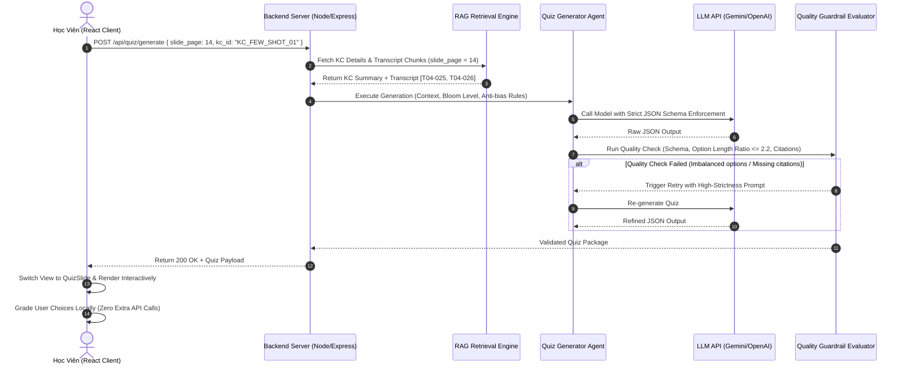

# KIẾN TRÚC GIẢI PHÁP TỔNG THỂ (ENTERPRISE SOLUTION ARCHITECTURE)
## Dự án: VLearn Atomic Micro-Quiz Generator — Intelligent Learning Verification Subsystem
**Tác giả / Vai trò:** Đinh Lê Hoàng Danh - Leader — Mini Hackathon AI (Batch 03)  
**Tình trạng:** Chốt kiến trúc kỹ thuật (Baseline v1.0)  
**Repository:** `d:\K3-parknotech` | **Nhánh:** `hoangdanh`

---

## 1. Tóm Tắt Tổng Quan (Executive Summary)

VLearn Micro-Quiz Generator là một hệ thống con (subsystem) phục vụ nền tảng học tập thích ứng VLearn, được thiết kế nhằm khép kín vòng lặp kiểm tra hiểu bài (**Explain → Verify → Misconception Detection**) ngay tại điểm học viên vừa tiếp thu một đơn vị kiến thức nguyên tử (**Knowledge Component - KC**).

Hệ thống giải quyết triệt để vấn đề "hổng kiến thức ngầm" của học viên bằng cách kết hợp **RAG (Retrieval-Augment Generation)** bám sát Transcript giảng dạy thực tế với **AI Quiz Agent** sử dụng cơ chế **Structured Output & Anti-bias Guardrails**. Toàn bộ kiến trúc được tối ưu theo mô hình **Bottom-Up**, đáp ứng nghiêm ngặt các ràng buộc về Quota (15 lượt call/ngày), độ trễ (Latency < 2.5s) và tính trung thực của dữ liệu trích dẫn (`[Txx-NNN]`).

---

## 2. Phân Tích Bài Toán & Bằng Chứng Khai Thác Dữ Liệu (Problem & Data Evidence)

### 2.1. Mining Evidence từ Chatlog VLearn
Phân tích định lượng trên 1.261 lượt hỏi–đáp (`data/vlearn-pack/chatlog/chat_history_anonymized_for_hackathon.csv`):
* **Thiếu hụt vòng lặp kiểm tra:** Tutor hiện tại chỉ thực hiện **3 lượt đặt câu hỏi kiểm tra** trên tổng số 1.261 lượt chat (tỉ lệ **0,24%**). Hành vi `validate_understanding` chỉ xuất hiện 1 lần, và số lượng `misconceptions` ghi nhận là **0**.
* **Nguy cơ lỗ hổng kiến thức ngầm:** Học viên sau khi nghe AI giải thích chỉ có cảm giác "đọc thấy quen" (illusion of competence) mà không có công cụ đo lường xem mình có thực sự nắm được cốt lõi hay không trước khi chuyển sang khái niệm tiếp theo.

### 2.2. Bằng Chứng Khảo Sát Thực Tế Học Viên Trong Lớp (Survey Responses - N = 20)
Kết quả khảo sát trực tiếp từ 20 học viên trong lớp (`data/respond/Khảo sát Thói quen Ôn tập & Kiểm tra Kiến thức (Responses) - Form Responses 1.csv`) phản ánh chính xác các rào cản hành vi và nhu cầu thực tế:

#### A. Hành vi kiểm chứng mức độ hiểu bài (Verification Behavior)
* **40,0% (8/20 học viên):** Cảm thấy hiểu nhưng **không có cách kiểm chứng cụ thể** hoặc chỉ xem qua rồi bỏ qua không kiểm chứng.
* **25,0% (5/20 học viên):** Phải tự đặt câu hỏi và tự trả lời (tùy hứng, thiếu căn cứ chuẩn để đối chiếu).
* **25,0% (5/20 học viên):** Phải làm lại bài tập được giao (tốn nhiều thời gian, không có phản hồi tức thì).

#### B. Khó khăn lớn nhất khi ôn tập (Verbatim Pain Points)
* **Thời gian hạn hẹp:** **65,0% (13/20 học viên)** chỉ dành $\le 15$ phút hoặc không ôn tập gì sau buổi học do quá mất thời gian.
* **Tài liệu quá dài & lan man (Trích dẫn nguyên văn từ khảo sát):**
  > *"Slide quá dài và nhiều thông tin, không biết nên học thế nào."*  
  > *"Không thể đọc được hết slide và không biết focus vào đâu để học."*  
  > *"Tài liệu dài lan man, hay đọc thừa... tốn rất nhiều thời gian để nhớ bài học."*  
  > *"Kiến thức dàn trải, không biết nên ôn gì."*

#### C. Mức độ sẵn sàng tham gia trải nghiệm Beta User (Willing Users)
* **75,0% (15/20 học viên):** Chọn *"Có, tôi rất muốn trải nghiệm"* tính năng AI Quiz ôn tập cuối buổi.
* **20,0% (4/20 học viên):** Chọn *"Để xem tính năng đó là gì đã"*.
* $\Rightarrow$ **Tổng mức độ sẵn sàng thử nghiệm (Willingness Rate):** **95,0% (19/20 học viên)** sẵn sàng trải nghiệm prototype.

#### D. Kỳ vọng cụ thể của Học viên đối với Công cụ
* *"Tôi kỳ vọng công cụ có thể đưa ra một bài kiểm tra ngắn ngay sau buổi học, gồm các câu hỏi phù hợp với nội dung vừa học và cho kết quả ngay lập tức."*
* *"Chỉ ra những chỗ ta đã hiểu rõ + chỗ ta hiểu mù mờ + giải thích lý do, nguyên nhân + hướng giải quyết tình trạng đấy."*

### 2.3. Định Hướng Thu Hẹp Scope (Bottom-Up Architectural Decision)
Theo phân tích từ chuyên gia/Lab Coach và bài toán Hackathon:
* **Loại bỏ mô hình Top-Down:** Không bắt AI đọc toàn bộ PDF slide hoặc chat history dài để tự sinh ra đề thi tổng hợp. Mô hình Top-Down tạo ra 3 rủi ro lớn: (1) Lan man không đúng trọng tâm bài học, (2) Dễ bị bẫy "đáp án dài nhất luôn đúng", (3) Tốn kém Quota token.
* **Áp dụng mô hình Bottom-Up:** Phân rã bài học thành các **Knowledge Component (KC)** nguyên tử. AI chỉ tập trung vào **MỘT LÁT CẮT**: Sinh bài kiểm tra 3 câu trắc nghiệm chất lượng cao cho đúng **MỘT KC** được kích hoạt.

### 2.4. Lát Cắt Một Câu (One-Sentence Architectural Slice)
> *"Khi một học viên hoàn thành một Knowledge Component (KC) trên VLearn → Học viên bấm 'Kiểm tra nhanh' → AI Agent gọi RAG lấy Transcript bài giảng gốc `[Txx-NNN]`, sinh ra 3 câu Micro-Quiz đáp ứng chuẩn Bloom Level + Cân bằng độ dài phương án → Hệ thống gửi JSON về Client để chấm điểm Local và hiển thị giải thích kèm trích dẫn."*

---

## 3. Kiến Trúc Hệ Thống Tổng Thể (System Architecture & Pipeline)

### 3.1. Sơ Đồ Kiến Trúc Thành Phần & Data Flow (End-to-End Diagram)

```mermaid
flowchart TD
    subgraph PHASE1["1. KNOWLEDGE INGESTION & INDEXING (Offline)"]
        A1["PDF Slides (day01_302.pdf)"] & A2["Clean Transcripts [Txx-NNN]"] --> B1["KC Extractor & Segmentation"]
        B1 --> C1[("KC Catalog & Vector Index (kc_index.json)")]
    end

    subgraph PHASE2["2. RUNTIME RAG & AGENT ENGINE (Server-Side)"]
        D1["Client Trigger (slide_page / kc_id)"] --> E1["API Gateway / Express Endpoint"]
        E1 --> F1{"RAG Retriever"}
        C1 -. Context Lookup .-> F1
        F1 -->|KC Metadata + Transcript Evidence| G1["Quiz Generation Agent (LLM)"]
        G1 -->|Structured Output JSON| H1{"Guardrail & Evaluator"}
        H1 -->|Fail: Length Ratio > 2.2| G1
        H1 -->|Pass: Valid Quiz| I1["API Response (3-Question JSON)"]
    end

    subgraph PHASE3["3. CLIENT STATE & LOCAL EVALUATION (Browser)"]
        I1 --> J1["React State (QuizSlide Component)"]
        J1 --> K1["User Interaction & Instant Grading (Local)"]
        K1 --> L1["Update Daily Quota Counter (14/15)"]
    end
```



### 3.2. Sơ Đồ Tương Tác Chi Tiết (Sequence Diagram)



---

## 4. Thiết Kế Quản Lý Kiến Thức & RAG Engine (Knowledge & RAG Design)

### 4.1. Cấu Trúc Dữ Liệu Knowledge Component Catalog (`kc_index.json`)
Dữ liệu kiến thức được tiền xử lý và lưu dưới dạng Catalog chuẩn hóa:

```json
[
  {
    "kc_id": "KC_FEW_SHOT_01",
    "kc_title": "Few-shot Prompting",
    "slide_pages": [14, 15],
    "transcript_refs": ["T04-025", "T04-026", "T04-027"],
    "concept_summary": "Phương pháp cung cấp một hoặc nhiều cặp ví dụ mẫu (input-output demonstrations) ngay trong câu lệnh để định hướng cho mô hình AI nhận diện nhiệm vụ và định dạng đầu ra.",
    "learning_objective": "Học viên phân biệt được Few-shot với Zero-shot và giải thích được khi nào cần dùng ví dụ mẫu.",
    "bloom_level": "Comprehension/Application",
    "common_misconceptions": [
      "Nhầm lẫn Few-shot là việc huấn luyện lại (fine-tuning) mô hình",
      "Nghĩ rằng Few-shot luôn yêu cầu mô hình phải lớn hơn Zero-shot"
    ]
  }
]
```

### 4.2. Chiến Lược Retrieval (Hybrid RAG Strategy)
1. **Primary Indexing (Metadata Lookup):** Khi học viên chọn trang Slide $N$, hệ thống thực hiện tra cứu trực tiếp theo mã `slide_pages` với độ trễ $O(1)$.
2. **Fallback / Semantic Search:** Nếu học viên yêu cầu tùy chỉnh chủ đề qua Chatbot, RAG Engine sử dụng Dense Vector Embeddings để truy vấn Top-2 KC có độ tương đồng Cosine cao nhất trong cơ sở dữ liệu.

---

## 5. Thiết Kế AI Agent & Anti-Bias Engineering (Agent Architecture)

### 5.1. Structured Output Schema Enforcement
Đầu ra của Agent bắt buộc tuân theo JSON Schema chuẩn mực để loại bỏ hoàn toàn lỗi vỡ định dạng (Parsing Failure):

```json
{
  "type": "object",
  "properties": {
    "kc_id": { "type": "string" },
    "kc_title": { "type": "string" },
    "questions": {
      "type": "array",
      "items": {
        "type": "object",
        "properties": {
          "id": { "type": "integer" },
          "prompt": { "type": "string" },
          "options": {
            "type": "array",
            "items": { "type": "string" },
            "minItems": 4,
            "maxItems": 4
          },
          "correct_index": { "type": "integer", "minimum": 0, "maximum": 3 },
          "explanation": { "type": "string" },
          "citation": { "type": "string" }
        },
        "required": ["id", "prompt", "options", "correct_index", "explanation", "citation"]
      },
      "minItems": 3,
      "maxItems": 3
    }
  },
  "required": ["kc_id", "kc_title", "questions"]
}
```

### 5.2. System Prompt Engineering & Rules
```text
You are an expert Educational Quiz Agent for an AI Engineering Course.
Your task is to generate a 3-question micro-quiz based SOLELY on the provided Knowledge Component (KC) and lecture transcript evidence.

STRICT GENERATION CONSTRAINTS:
1. SINGLE-KC FOCUS: Ask questions strictly within the boundaries of the provided KC.
2. OPTION LENGTH BALANCE (CRITICAL): All 4 options (A, B, C, D) for each question MUST have similar character lengths (variance <= 20%). NEVER make the correct option noticeably longer or more detailed than the distractors.
3. MISCONCEPTION DISTRACTORS: Derive incorrect options directly from the provided common student misconceptions.
4. CITATION REQUIREMENT: Every explanation MUST cite the exact transcript chunk ID provided in the context (e.g. [T04-025]).

Return strictly valid JSON complying with the required schema.
```

---

## 6. Kiểm Soát Chất Lượng & Quản Lý Rủi Ro (Guardrails & Risk Taxonomy - R3)

Hệ thống quản lý triệt để 4 lớp chỗ khó theo yêu cầu đánh giá Hackathon:

| Lớp Rủi Ro (Taxonomy) | Nguy Cơ Thực Tế | Cơ Chế Kiểm Soát (Guardrail Solution) |
|---|---|---|
| **① Nguồn sự thật** | AI tự sáng tác kiến thức ngoài slide/transcript | Giới hạn Context RAG bám sát 100% mã đoạn `[Txx-NNN]`; yêu cầu trích dẫn bắt buộc trong `citation`. |
| **② Mơ hồ / Thiếu thông tin** | Trang slide quá ngắn hoặc không có đề mục | Dùng Transcript lời giảng của giảng viên làm Ground Truth chính; tự động gán KC Catalog offline. |
| **③ Thẩm quyền / Ngoài scope** | User đòi sinh đề thi chính thức hoặc dự đoán điểm | Agent chỉ trả về Micro-quiz 3 câu mang tính tự đánh giá (diagnostic), không ghi nhận điểm chính thức. |
| **④ Đặc thù Domain** | Lỗi bẫy "câu dài nhất đúng" hoặc sai kiến thức AI | Bộ lọc **Option Length Ratio** $\le 2.2$; kiểm soát nghiêm ngặt thuật ngữ AI (Zero-shot, Few-shot, RAG). |

### Thuật Toán Guardrail Kiểm Tra Độ Lệch Độ Dài (Option Length Ratio Metric):
$$\text{Length Ratio} = \frac{\max(\text{len}(O_1), \text{len}(O_2), \text{len}(O_3), \text{len}(O_4))}{\min(\text{len}(O_1), \text{len}(O_2), \text{len}(O_3), \text{len}(O_4))} \le 2.2$$

Nếu $\text{Length Ratio} > 2.2$, Backend Evaluator sẽ gắn nhãn cảnh báo (Warning Flag) và kích hoạt luồng cân bằng lại câu chữ hoặc Retry 1 lần.

---

## 7. Thiết Kế Client & Tối Ưu Hóa Quota (Client Architecture)

### 7.1. Chấm Điểm Local (Zero-Cost Interactivity)
* **Chiến lược Quota:** Mọi lời gọi AI chỉ phát sinh khi sinh Quiz (1 batch = 1 API Call).
* **Xử lý phía Browser:** Việc kiểm tra đáp án đúng/sai (`correct_index`), tính tổng điểm % (`score/3`), hiển thị giải thích và nút làm lại (`Reset`) được quản lý bằng React `useState` hoàn toàn trên Browser.
* **Hiệu năng:** Độ trễ chấm điểm = 0ms. Tiết kiệm tối đa 15 lượt gọi AI trong ngày cho học viên.

---

## 8. Khung Đánh Giá & Kiểm Thử Chất Lượng AI (AI Evaluation & Golden Set - R4)

### 8.1. Cấu Trúc Golden Set (`eval/golden_set.json`)
Xây dựng bộ kiểm thử chuẩn gồm 15 Knowledge Components đại diện từ 6 file Transcript sạch (`transcript-01` đến `transcript-06`).

### 8.2. Hệ Thống Chỉ Số Đánh Giá (Evaluation Metrics)

$$\text{Total Quality Score} = 0.3 \cdot S_{\text{schema}} + 0.3 \cdot S_{\text{kc\_align}} + 0.2 \cdot S_{\text{length\_balance}} + 0.2 \cdot S_{\text{citation}}$$

1. **Schema Pass Rate ($S_{\text{schema}}$):** $100\%$ tuân thủ định dạng JSON.
2. **KC Alignment Score ($S_{\text{kc\_align}}$):** $\ge 90\%$ câu hỏi phủ đúng mục tiêu bài học.
3. **Option Length Balance Score ($S_{\text{length\_balance}}$):** $\ge 85\%$ số câu đạt $\text{Length Ratio} \le 2.2$.
4. **Citation Accuracy Score ($S_{\text{citation}}$):** $100\%$ câu trả lời trích dẫn đúng mã đoạn `[Txx-NNN]`.

---

## 9. Lộ Trình Triển Khai Theo Checkpoint (Checkpoint Matrix)

| Checkpoint | Deliverable Trọng Tâm | Tình Trạng Repo |
|---|---|---|
| **CP1** | Chốt Canvas + Evidence Mining (`canvas.md`, `cp1-mining.md`) | **ĐÃ HOÀN THÀNH** |
| **CP2** | Prototype UI Mock (`codebase/src/App.jsx`) | **ĐÃ HOÀN THÀNH** |
| **CP3** | Tích hợp AI Call thật + RAG Engine + Đo lượt đầu | *Đang triển khai* |
| **CP4** | Chốt Spec cứng 23:59 N1 (`spec.md`) | *Đang chuẩn bị* |
| **CP5** | Validation log với User + Testing + Dry Run | *Kế hoạch N2* |
| **CP6** | Slide 6 trang + Demo chính thức | *Kế hoạch N2* |

---
*Tài liệu được biên soạn và phê duyệt bởi Senior Solution Architect — Phục vụ nghiệm thu Hackathon Batch 03.*
